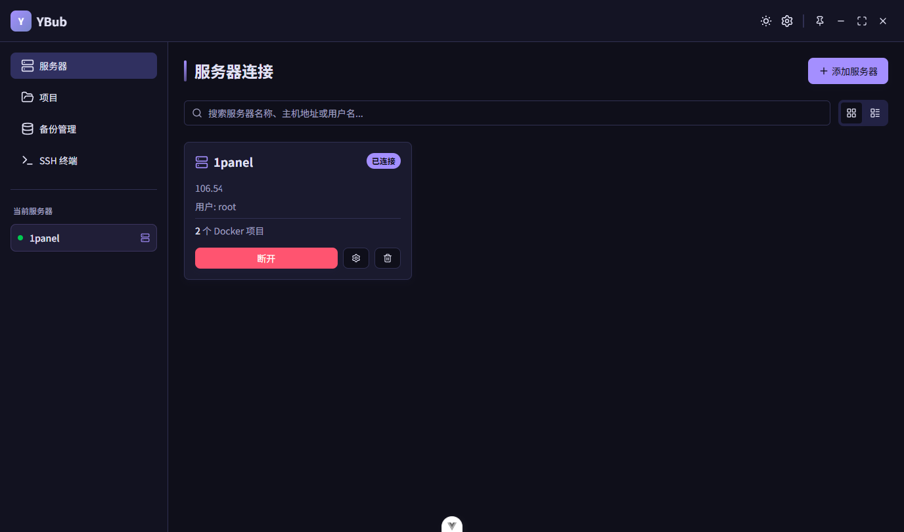
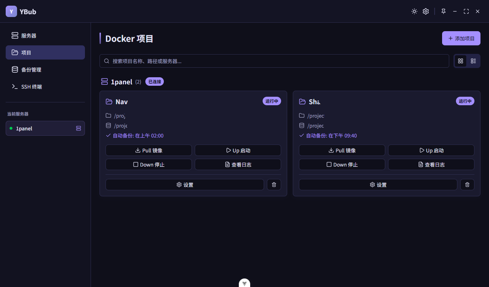
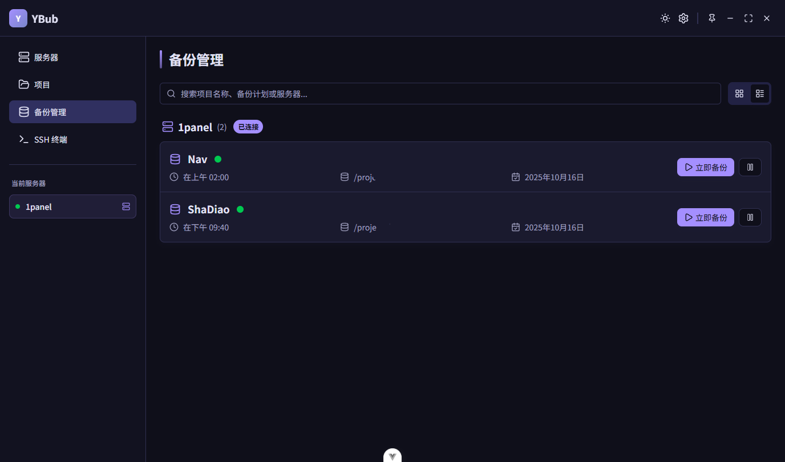
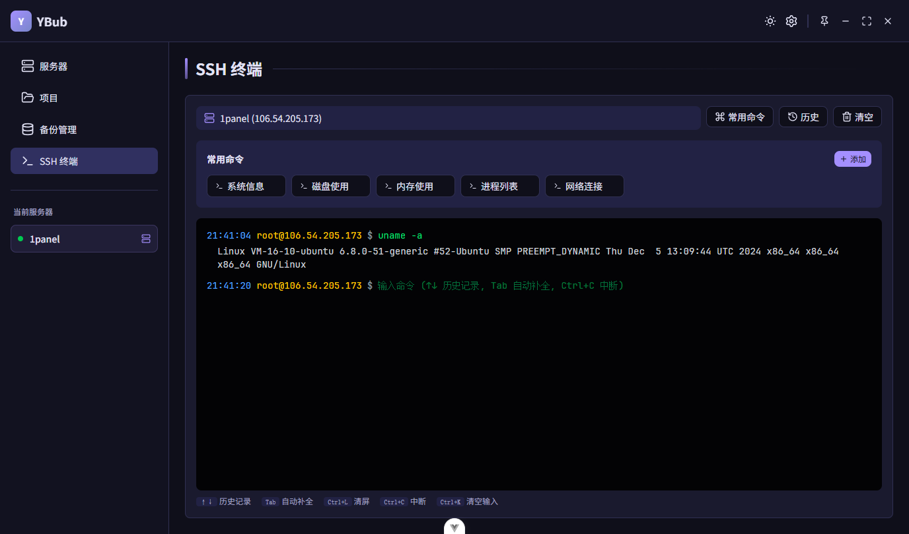

# 🐳 YBub

> 一款基于 **Wails 3 + Vue 3** 的远程 Docker 管理工具

YBub 旨在帮助开发者轻松管理多台服务器上的 Docker 容器、镜像与数据备份。
支持 SSH 连接、命令执行、实时日志查看，并内置夜间/日间主题切换。

---

## ✨ 功能特点

- 🧩 **多服务器支持**：可同时连接并管理多台服务器
- 🐋 **Docker 管理**：支持容器、镜像、网络、卷等常用操作
- 💾 **数据备份**：支持项目级自动/手动备份任务到本地
- 🔐 **SSH 支持**：内置 SSH 连接，可执行命令并实时查看输出
- 🌗 **夜间/日间模式**：界面美观，明暗主题

---

## 🧰 技术栈

| 分类     | 技术                                                               |
| -------- | ------------------------------------------------------------------ |
| 框架     | [Wails 3 alpha](https://v3alpha.wails.io/) + [Vue 3](https://vuejs.org/) |
| 语言     | Go + TypeScript                                                    |
| 构建工具 | Vite                                                               |
| UI 框架  | Tailwind CSS + 自定义组件                                          |
| 日志     | Zerolog                                                            |
| 图标     | Lucide / Iconify                                                   |

---

## 🖥️ 截图

## wails3需要改进

1. w3无法强制binding, 需要强行注册服务, 即使前端不需要该部分函数
2. 不能控制导出内容, 即使前端不需要该部分函数
3. 在stores里写的ts文件修改 无法触发hmr, 只能ctrl r刷新
